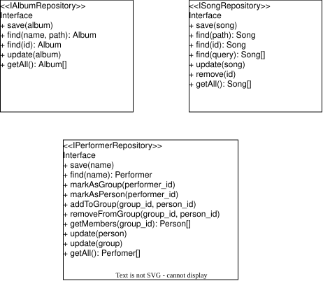

La gestión de la base de datos es ofrecida en gran medida por las abstracciones de Qt. Por eso, utilizaremos una clase de gestión bastante simple.

El patrón de diseño **repository** nos permite abstraer las operaciones de la base de datos y utilizarla desde el código.

