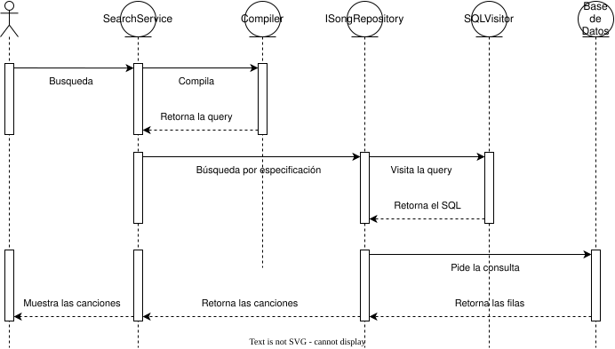

Siguiendo la grámatica descrita en el apartado [[DSL]], seguimos planificando la implementación del compilador.

El consumo de la compilación está separado de las demás implementaciones del programa, podemos ver el flujo de datos aquí.

