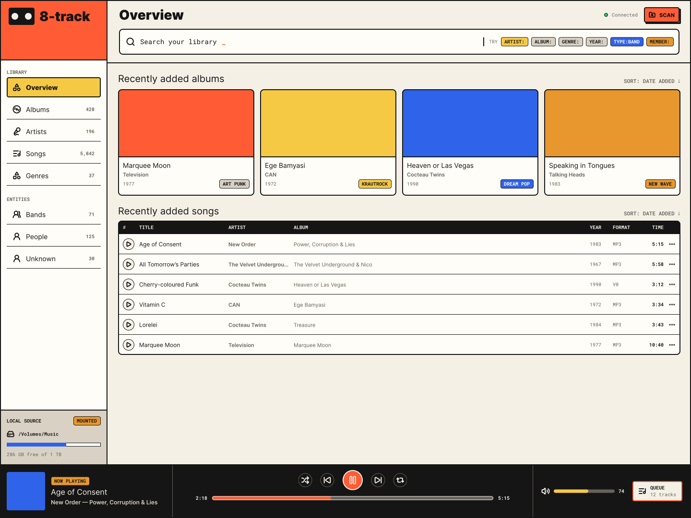
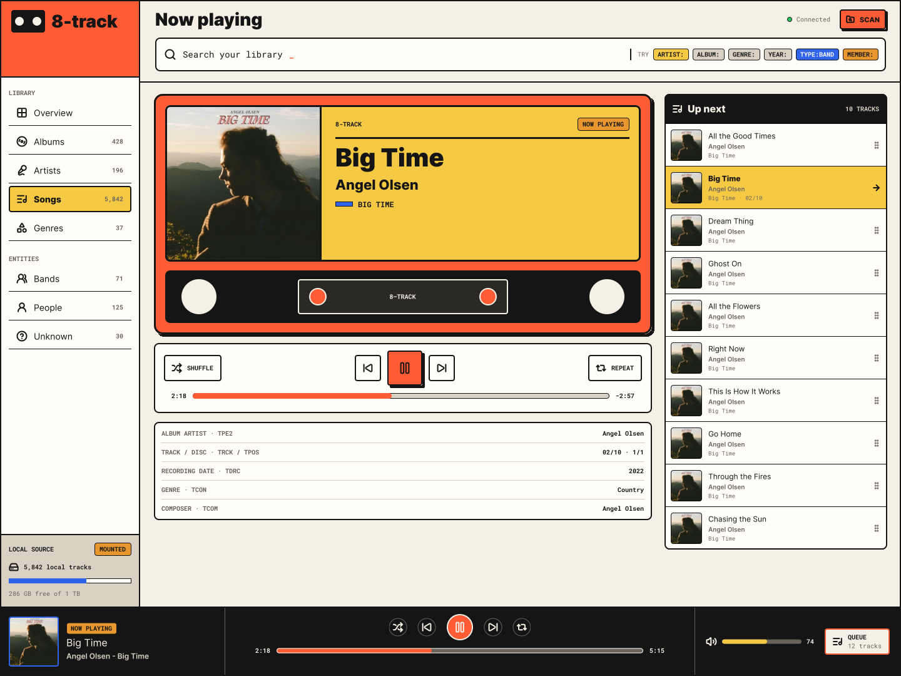
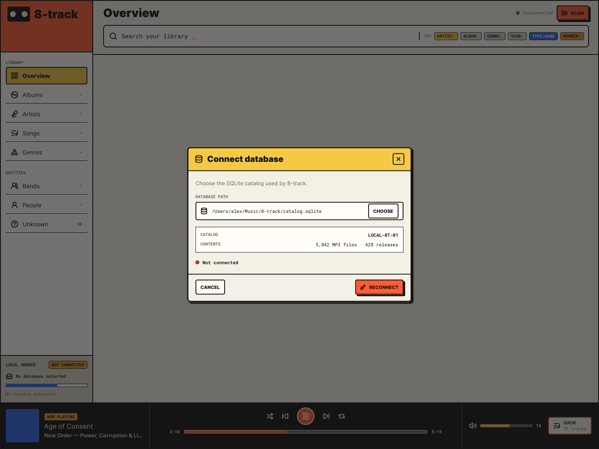
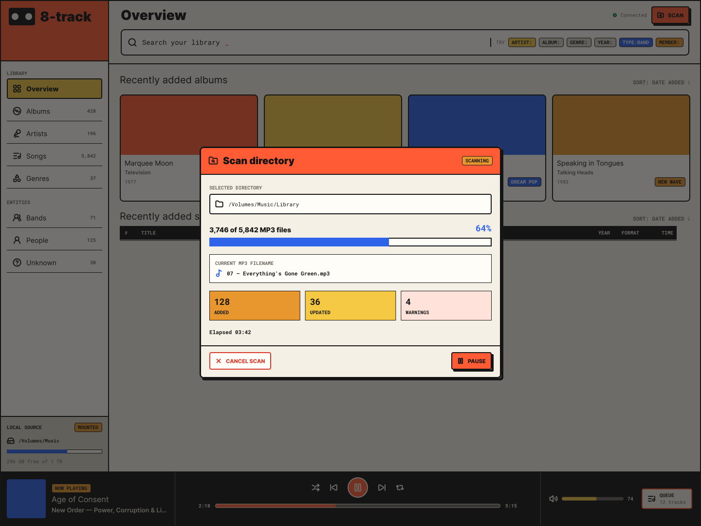
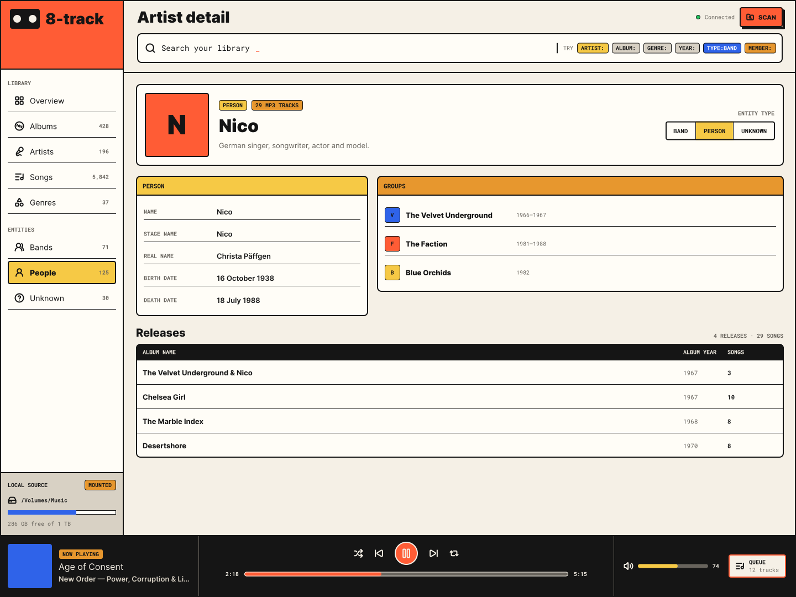
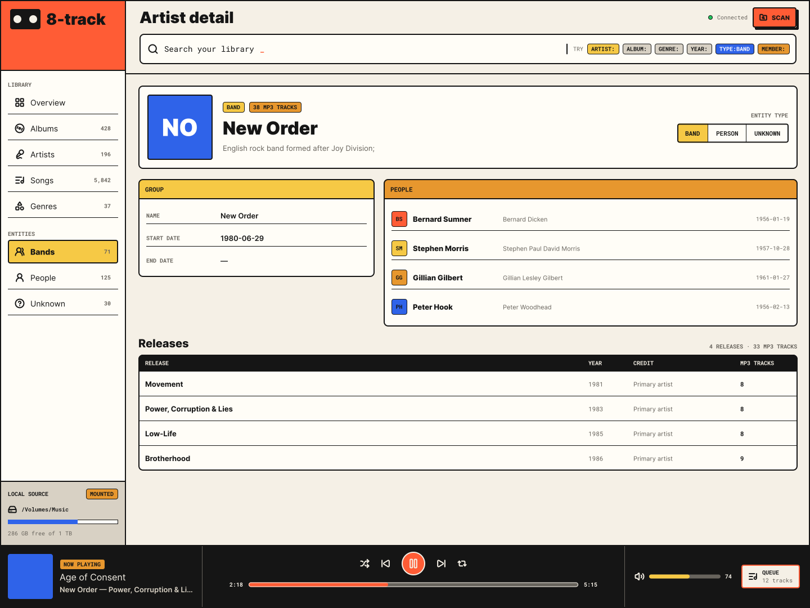

La interfaz de usuario del [[Proyecto 2]] está basada en el estilo neobrutalista. Los mockups mostrados fueron diseñados en **Figma** con la ayuda de **agents**. 
## Landing Page

## Player

## Connection

## Miner

## Artist

## Group

