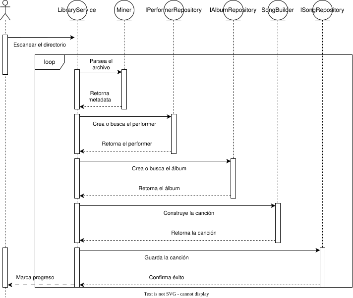

El minero utilizará internamente Taglib para obtener los metadatos de cada canción.

El flujo de datos permite utilizar el minero como una biblioteca que no depende de las demás partes del programa. Solo se encarga de encontrar metadatos de las canciones y consumir los datos para el servicio de libreria.

