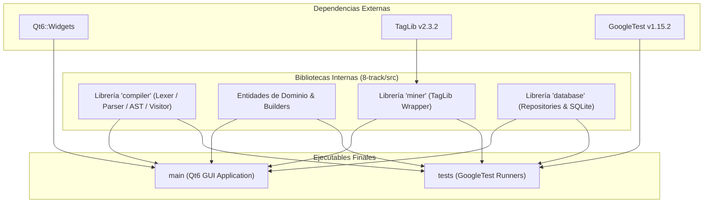
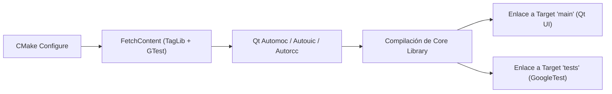
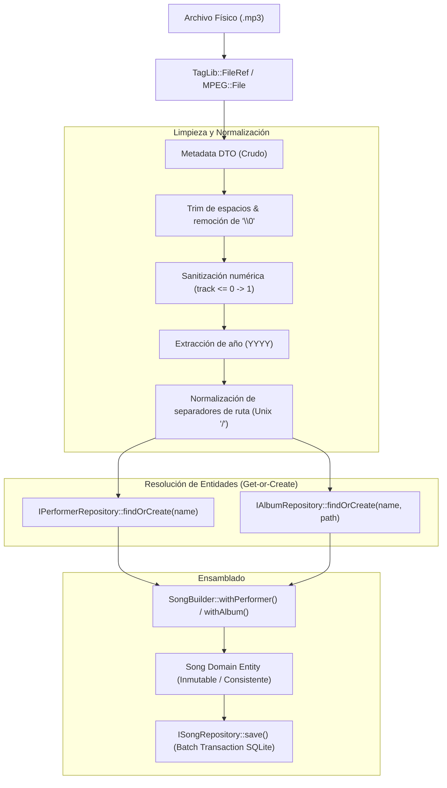
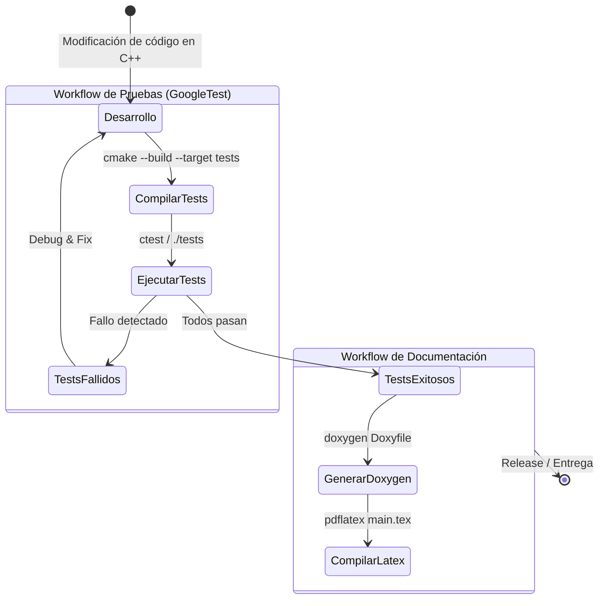

# 8-Track: Diseño, Stack y Pipelines del Repositorio

> [!abstract] Resumen
> Documento técnico de referencia sobre la arquitectura de software, stack tecnológico, gestión de dependencias en CMake, separación modular de bibliotecas, pipelines de datos y flujos de trabajo del repositorio **8-Track**.

---

## 1. Stack Tecnológico y Gestión de Dependencias

| Componente          | Tecnología | Versión / Detalle                    | Justificación y Rol en el Repo                                                                                                             |
| :------------------ | :--------- | :----------------------------------- | :----------------------------------------------------------------------------------------------------------------------------------------- |
| **Lenguaje Core**   | C++        | C++20 (`set(CMAKE_CXX_STANDARD 20)`) | Rendimiento nativo, control estricto de memoria y uso de características modernas (`std::filesystem`, `std::optional`, `std::shared_ptr`). |
| **Build System**    | CMake      | 3.25+                                | Sistema de construcción estándar multiplataforma y orquestador de dependencias.                                                            |
| **Framework GUI**   | Qt6        | `Qt6::Widgets`                       | Gestión de ventanas y widgets nativos con estética Neobrutalista. Utiliza herramientas automáticas (`AUTOMOC`, `AUTOUIC`, `AUTORCC`).      |
| **Audio Metadata**  | TagLib     | v2.3.2                               | Motor de lectura de tags ID3v2.4 en archivos `.mp3`. Integrado de forma desacoplada de la UI.                                              |
| **Testing**         | GoogleTest | v1.15.2                              | Framework de pruebas unitarias para el compilador del DSL y el minero.                                                                     |
| **Base de Datos**   | SQLite     | Qt SQL (`QSqlDatabase`)              | Persistencia embebida en disco sin necesidad de demonio o servidor externo.                                                                |
| **DSL de Consulta** | MuQL       | Motor propio en C++                  | Lenguaje de dominio tipo GitHub Search para búsquedas avanzadas y semánticas.                                                              |

### Descarga Automática de Bibliotecas con `FetchContent`

En el `CMakeLists.txt` raíz, las dependencias externas que no forman parte del sistema base se gestionan de forma declarativa y reproducible mediante `FetchContent`:

```cmake
include(FetchContent)

# 1. GoogleTest para testing unitario
FetchContent_Declare(
    GoogleTest
    GIT_REPOSITORY https://github.com/google/googletest.git
    GIT_TAG v1.15.2
)

# 2. TagLib para minado de etiquetas ID3v2.4
FetchContent_Declare(
    Taglib
    GIT_REPOSITORY https://github.com/taglib/taglib.git
    GIT_TAG v2.3.2
)

FetchContent_MakeAvailable(GoogleTest)
FetchContent_MakeAvailable(Taglib)
```

> [!tip] Ventaja de `FetchContent`
> Evita la necesidad de instalar dependencias globales o submódulos manuales. Al clonar el repositorio, CMake descarga, compila y enlaza automáticamente las versiones exactas fijadas en las etiquetas de Git.

---

## 2. Arquitectura y Separación de Bibliotecas

El repositorio separa estrictamente las responsabilidades para mantener el núcleo libre de dependencias hacia la capa gráfica (UI):

```
8-track/
├── CMakeLists.txt                  # Configuración raíz y orquestación
├── main.cpp                        # Entry point (inicializa Qt Application)
├── 8-track/                        # Módulos Core del sistema
│   ├── CMakeLists.txt              # Define la librería estática 'compiler' / core
│   ├── include/
│   │   ├── compiler/               # TokenType.hpp, Token.hpp, Lexer, Parser, AST, Visitor
│   │   ├── database/               # DatabaseManager, ISongRepository, IAlbumRepository, etc.
│   │   ├── domain/entities/        # song.hpp, album.hpp, performer.hpp, person.hpp, group.hpp
│   │   └── miner/                  # Miner.hpp, Metadata.hpp
│   └── src/
│       ├── compiler/               # Implementación del motor léxico/sintáctico
│       ├── database/               # Repositorios concretos sobre SQLite
│       ├── domain/                 # Métodos de dominio
│       └── miner/                  # Implementación sobre TagLib
├── tests/                          # Tests unitarios independientes de la UI
│   ├── CMakeLists.txt
│   ├── compiler/                   # Pruebas de tokens, parser y árbol AST
│   └── miner/                      # Pruebas de extracción de tags MP3
└── docs/                           # Documentación y reportes
    ├── report/                     # Reporte académico en LaTeX
    └── html/                       # Salida generada por Doxygen
```



> [!important] Regla de Desacoplamiento
> - **El Minero (`Miner`):** Depende exclusivamente de `TagLib` y la STL de C++ (`<filesystem>`, `<string>`). **No depende de Qt ni de la base de datos**.
> - **El Compilador (`Compiler` / MuQL):** No depende de Qt ni de SQLite directamente; expone un AST y genera representaciones intermedias consumibles mediante el patrón **Visitor** (`SQLVisitor`).

---

## 3. Pipelines de Procesamiento en el Repositorio

### A. Pipeline de Construcción (Build Pipeline)



1. **Configuración de Estándar:** `CMAKE_CXX_STANDARD 20` requerido.
2. **Preprocesamiento Qt:** `CMAKE_AUTOMOC`, `CMAKE_AUTOUIC` y `CMAKE_AUTORCC` activados para transformar macros `Q_OBJECT`, formularios `.ui` y recursos `.qrc`.
3. **Generación de Includes:** `target_include_directories` exporta `$<BUILD_INTERFACE:.../include>` para que cualquier target dependiente acceda limpiamente a los headers como `#include "compiler/Token.hpp"`.

---

### B. Pipeline de Minería y Ensamblado de Canciones



- **Patrón Builder en C++:** `Song` protege su constructor haciéndolo privado y otorga acceso exclusivo a `SongBuilder` vía `friend class SongBuilder`.
- **Compartición de memoria:** Se utilizan `std::shared_ptr<Performer>` y `std::shared_ptr<Album>` para evitar duplicaciones de instancias en memoria durante el ensamblado.

---

### C. Pipeline del Compilador MuQL (DSL)

```mermaid
flowchart LR
    A["Query String (MuQL)"] --> B["Lexer (Token.hpp / TokenType.hpp)"]
    B -->|Stream de Tokens| C["Parser (Recursive Descent)"]
    C -->|Desambiguación & Operadores Implícitos| D["Specification AST"]
    D --> E["Semantic Validator"]
    E --> F["SQLVisitor"]
    F -->|SQL Parametrizado| G["QSqlQuery (SQLite Engine)"]
    G --> H["Hydration a std::vector<Song>"]
```



- **Tokenización:** Mapeo de literales, números, símbolos (`:`, `=>`, `:=`, `(`, `)`) y palabras reservadas (`and`, `or`, `not`, `similar`, `sort`, `from`, `to`, `year`, `track`, etc.).
- **Desambiguación:** Inserción de nodos `AND` implícitos entre términos contiguos y agrupación de listas de valores disyuntivas (`OR` implícito).
- **Traducción desacoplada:** El `SQLVisitor` transforma las ramas lógicas del AST en cláusulas `WHERE` y `ORDER BY` con parámetros vinculados (`bindValue`), previniendo inyecciones SQL.

---

## 4. Estrategia de Limpieza y Calidad de Código (Code Hygiene)

> [!warning] Puntos Críticos de Memoria y Tipado en C++
> 1. **Token Lexeme Lifetime:**
>    - En `Token.hpp`, almacenar `const std::string& m_lexeme` genera punteros colgantes (*dangling references*) si el token se construye a partir de un temporal. Debe almacenarse por valor (`std::string m_lexeme`) y transferirse mediante `std::move`.
> 2. **Constructores de Entidades:**
>    - `Album` y `Performer` deben recibir `const std::string&` o `std::string` por valor con `std::move`, permitiendo inicialización con literales de cadena (`const char*`).
> 3. **Gestión de Opcionales:**
>    - `std::optional<Date>` para fechas de defunción en artistas y fechas de disolución en agrupaciones.

---

## 5. Workflows de Desarrollo



1. **Workflow TDD / Pruebas:**
   - Pruebas automatizadas en `tests/compiler` y `tests/miner` que validan el lexer, parser y extracción de tags de forma aislada sin levantar la GUI de Qt.
2. **Workflow de Documentación:**
   - **Doxygen:** Generación de documentación de código con estilo moderno mediante *Doxygen Awesome*.
   - **Reporte Académico:** Documento formal en LaTeX estructurado en `docs/report/sections/` (`01-introduction.tex`, `02-analysis_and_design.tex`, `03-implementation.tex`, `04-conclusions.tex`).
